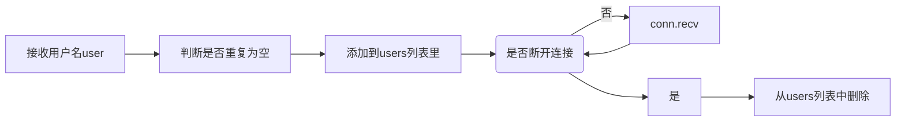

# chatroom
基于pyqt的聊天室小程序

修改自项目https://gitee.com/huangxing123/The-chat-room

- 只保留其基础聊天功能
- 包括群聊和匿名聊天功能
- 显示同时在线用户名
- 修改GUI框架为PYQT5


## server

分配端口50007 使用本地服务器127.0.0.1

将服务器放在一个线程中

### 全局变量

```
que = queue.Queue()                             # 用于存放客户端发送的信息的队列**
users = []                                      # 用于存放在线用户的信息  [conn, user, addr]
lock = threading.Lock()                         # 创建锁, 防止多个线程写入数据的顺序打乱
```

### Class:ChatServer 继承threading.Thread

self.ADDR：服务器IP地址和端口

self.s：该服务器调用socket对象

> sys.path是python的搜索模块的路径集 sys[0]表示该脚本所在路径


### sendData 作为一个单独的线程 一直在循环 队列中一有消息就会发出


最开始连接client时，message[1]是addr是个list  

正常接收消息时，message[1]是data是个str

对上述分开处理

### tcp_connect 用于接收所有客户端发送信息函数

输入参数：self conn addr

- conn:已经连接的socket对象 

- addr[0]:IP地址 addr[1]:Port

users：包含所有用户信息的list

- users[0]:conn users[1]:user users[2]:addr




*Q:在持续接收的while true循环外面更新了当前在线用户数目，这是怎么跳出while true循环更新的*

*A:每次新开启一个clinet都会新创建一个thread,在不同的thread中开启不同的while true循环，这样每次新建的时候都会更新online user name*

### recv

采用线程锁 将收到的data username addr都加入que中

先放(username, addr) --> (addr, data) 

## client


### login_window

init:获取客户端IP Port User name 

开启chatroom主窗口

### main_window

#### init初始化

```python
self.pushButton.clicked.connect(self.send)  # 发送连接槽
self.listWidget.currentItemChanged.connect(self.private)  # 私聊模式连接 选中list后触发
self.update_txt.connect(self.update_text)  # 线程内更新信号连接 
```


#### closeEvent

重写关闭窗口事件，关闭socket连接

#### send

按和server的通信协议格式发送

#### recv

无字符‘;:’时为接受到在线用户列表，当加入新用户时刷新列表

有这个字符时为收到的信息，将消息，用户名，聊天对象按顺序append到list_signal中，在emit出去

**这里要注意的是 接收信息后不在recv的线程里更新UI，而是emit一个update_txt信号，将更新的消息data1 用户名data2 聊天对象data3发出去，update_text信号槽接收这些参数并显示在UI上**

*不然界面可能会显示异常（光标选中一下才显示出来）！！！！而且无法使用appendPlainText这个函数*

#### update_text

接收recv线程中的list,并分情况用对应字体颜色在接收框显示文本

#### private

私聊功能，获取选中list中item对象，并更新聊天对象self.chat，将当前聊天状态显示在窗口title上

## 基本的通信协议

```
self.plainTextEdit_2.toPlainText() + ':;' + user + ':;' + chat
```

[发送信息 ';:' 用户名 ';:' 聊天对象]

server利用分隔符 ';:' 获取信息

## 使用说明

### 开启服务器


命令行运行server.py脚本 出现chat server starts running ..表示服务器正常运行

### 启动三个客户端

#### 群聊模式

蓝字为自己发送的信息 绿字为群聊模式下收到别的用户发送的信息


#### 私聊模式

在no.1的客户端选中列表中的no.2即可进入对no.2的私聊模式，聊天字体显示红色


当选中'------Group chat-------'时，重新回到群聊模式
